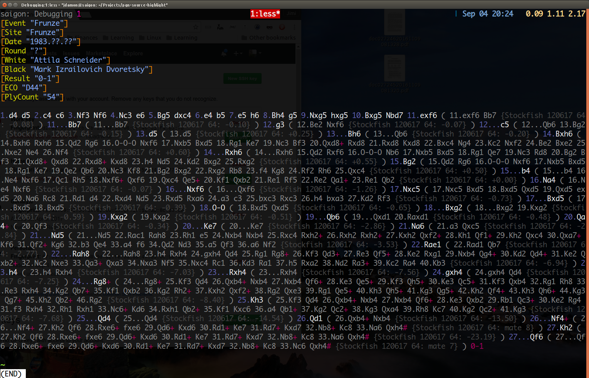

# pgn-source-highlight
PGN Source highlight 


This repo contains files that make it possible to syntax highlight PGN
( Portable Game Notation ) Chess game files. 

I created this as a means to make it easier to view complicated PGN
files and follow the moves being made if 1. there were lots of
variations in the analysis of the game ( ie. ( .. ) blocks ) or 2. if
there were lots of comments sprinkled throughout the game.

I created a simple pgn source highlighter that makes it easy to "Less"
these files on a Linux/Mac/Cygwin system. 


Setup,

```bash
export LESSOPEN='| /usr/bin/source-highlight-esc.sh %s' 
```

Copy these three files to the correct locations

```bash
cp pgn.lang  /usr/share/source-highlight/
cp pgn.style /usr/share/source-highlight/
cp /usr/bin/source-highlight-esc.sh /usr/bin/source-highlight-esc.sh.bak
cp source-hightlight-esc.sh /usr/bin
```

and then just do 

```bash
less pgns/schneider_dvoretsky_annotated_1983.pgn
```


You should see something that resembles this picture.




As you can see, it's much easier to follow the actual moves of the
game as they show up in high contrast in white compared to the
variation moves ( lighter grey ) and then the Stockfish annotations (
dark grey ).
